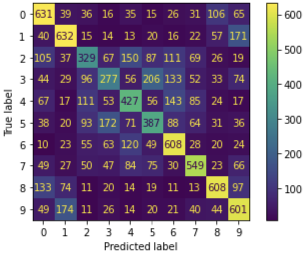

# CIFAR-10 Classification Using MLP and CNN Architectures

We load the dataset and display some samples. The dataset contains 60,000 color images categorized into 10 classes.
<p float="left">
  
  
  
</p>
Part1: MLP model

First, we use an MLP network to train a classifier. 

For doing so, we use stochastic mini-batch. We consider 2 hidden layers, and use trial and error to determine other hyperparameters like loss functions, learning rate, etc., to achieve more accurate results.

We transform images from (32,32,3) to 3072-dimensional vectors (32x32x3), and Normalization of pixel values to [0-1] range to make the calculations faster.

For our initial model, we use the following parameters:

optimizer: stochastic gradient descent
number of hidden layers: 2
Other hyperparameters like the loss function and the learning rate were found with trial and error as below:
loss function = categorical_crossentropy
learning rate = 0.01
We also used momentum (0.9) to improve my results.

We plot the changes in model accuracy and error for each epoch on the validation and training data. We also calculate the error, accuracy, and confusion matrix for the test data.

We use three batch sizes of 32, 64, and 256, and examine the effect of batch size on the accuracy and training time of the network.

for batchsize = 32:
<p float="left">
  
  
</p>

for batchsize = 64:
<p float="left">
  
  
</p>

for batchsize = 256:
<p float="left">
  
  
</p>

As it can be seen, the accuracy is about 0.51 and each epoch takes about 4 seconds to train. So, the best results happen with the maximum batch size (256). The model is faster and has a better accuracy compared to the other 2 models.

We change the activation functions of each layer and examine their impact on network training accuracy. 

Activation functions: **eLU, eLU, Softmax**

<p float="left">
  
  
</p>

Confusion Matrix:



Activation functions: **tanh, tanh, Softmax**

<p float="left">
  
  
</p>

Confusion Matrix:


Activation functions: **sigmoid, sigmoid, Softmax**

<p float="left">
  
  
</p>

Confusion Matrix:


As it can be seen, the accuracy is about 0.317 which means the sigmoid activation function is worse than the relu activation function. So, it can be concluded that the relu activation function is better than all the other choices.


We hange the loss function of the network and examine the impact of different loss functions on the accuracy of network training. 

Loss Function: **MeanSquaredError**

<p float="left">
  
  
</p>

Confusion Matrix:


Loss Function: Hinge Loss

<p float="left">
  
  
</p>

Confusion Matrix:


As it can be seen, in both cases the accuracy is worse than the categorical_crossentropy loss function. So, it can be concluded that the best loss function is the categorical_crossentropy loss.

We change the network's optimizer and examine the effect of different optimizers on the network's accuracy. 

Optimizer = **Adam**
<p float="left">
  
  
</p>

Optimizer = **RMSprop**
<p float="left">
  
  
</p>

As it can be seen, the accuracy is about 0.445 which means the RMSprop optimizer is worse than the stochastic gradient descent optimizer.

According to the above results, the best model has the parameters as below:

batch size = 256

optimizer: SGD

Loss Function: categorical class entropy

Activation Functions: ReLU, ReLU, Softmax

These are the results of the final model:

<p float="left">
  
  
</p>

Confusion Matrix:


We report other evaluation metrics, including F-Score, and Precision.

```
F1 Score =  0.5298009011267364
Precision Score =  0.5394033772373297
```

Part2: MLP+CNN model
