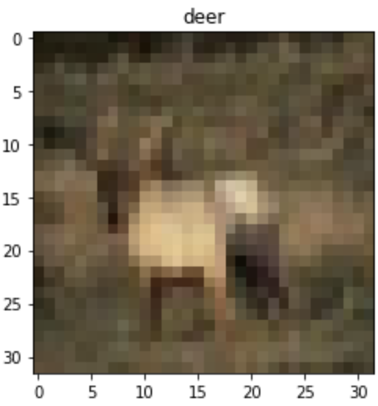
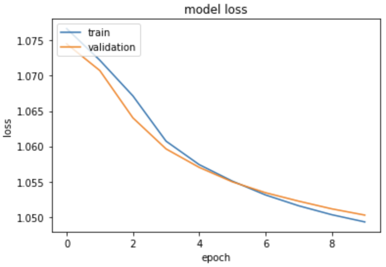

# CIFAR-10 Classification Using MLP and CNN Architectures

This project involves classifying the CIFAR-10 dataset using both MLP and CNN architectures, exploring the effects of various hyperparameters.

## Dataset Overview

The CIFAR-10 dataset consists of 60,000 color images categorized into 10 classes. Below are some sample images from the dataset:

<p float="left">
  
  
  
</p>

---

## Part 1: MLP Model

We start by training a classifier using a Multilayer Perceptron (MLP) network. The key steps include:

- Using **stochastic mini-batch** for training.
- Defining 2 hidden layers.
- Optimizing hyperparameters (loss function, learning rate, etc.) through trial and error.

### Data Preprocessing

- Reshape images from (32x32x3) to 3072-dimensional vectors.
- Normalize pixel values to the [0-1] range for faster calculations.

### Model Parameters

- **Optimizer**: Stochastic Gradient Descent (SGD)
- **Loss Function**: Categorical Crossentropy
- **Learning Rate**: 0.01
- **Momentum**: 0.9

We evaluated the model's accuracy and error across various epochs on both training and validation datasets.

### Batch Size Experiment

We tested three different batch sizes (32, 64, 256) to evaluate their impact on model performance:

**Batch size = 32:**
<p float="left">
  
  
</p>

**Batch size = 64:**
<p float="left">
  
  
</p>

**Batch size = 256:**
<p float="left">
  
  
</p>

From the results, we found that the largest batch size (256) provided the best performance in terms of both speed and accuracy.

### Activation Function Comparison

We experimented with different activation functions for the hidden layers to observe their effect on network accuracy.

**Activation functions: eLU, eLU, Softmax**
<p float="left">
  
  
</p>
Confusion Matrix:


**Activation functions: tanh, tanh, Softmax**
<p float="left">
  
  
</p>
Confusion Matrix:


**Activation functions: sigmoid, sigmoid, Softmax**
<p float="left">
  
  
</p>
Confusion Matrix:


As seen above, ReLU provides the best accuracy, while sigmoid underperforms significantly.

### Loss Function Experiment

We tested different loss functions to compare their effect on model performance:

**Loss Function: MeanSquaredError**
<p float="left">
  
  
</p>
Confusion Matrix:


**Loss Function: Hinge Loss**
<p float="left">
  
  
</p>
Confusion Matrix:


Categorical cross-entropy proved to be the most effective loss function.

### Optimizer Comparison

We compared the performance of different optimizers:

**Optimizer: Adam**
<p float="left">
  
  
</p>

**Optimizer: RMSprop**
<p float="left">
  
  
</p>

RMSprop performed worse compared to SGD in terms of accuracy.

### Best Model Summary

After various experiments, the best-performing model was configured as follows:

- **Batch size**: 256
- **Optimizer**: SGD
- **Loss Function**: Categorical Crossentropy
- **Activation Functions**: ReLU, ReLU, Softmax

<p float="left">
  
  
</p>
Confusion Matrix:


Additionally, we report the F1 Score and Precision:

```
F1 Score = 0.5298
Precision Score = 0.5394
```


---

## Part 2: MLP + CNN Model

To enhance the classifier’s performance, we added convolutional layers to the best MLP model obtained in Part 1.

### Model with Convolutional Layers

We incorporated pooling and batch normalization layers to further improve performance:

<p float="left">
  
  
</p>
Confusion Matrix:


### Dropout Layer

Adding dropout layers improved accuracy and reduced loss:

<p float="left">
  
  
</p>
Confusion Matrix:


### Early Stopping

We implemented early stopping to prevent overfitting:

<p float="left">
  
  
</p>
Confusion Matrix:


---

The final model achieved an accuracy of 0.70 on the test data and 0.99 on the training data.
